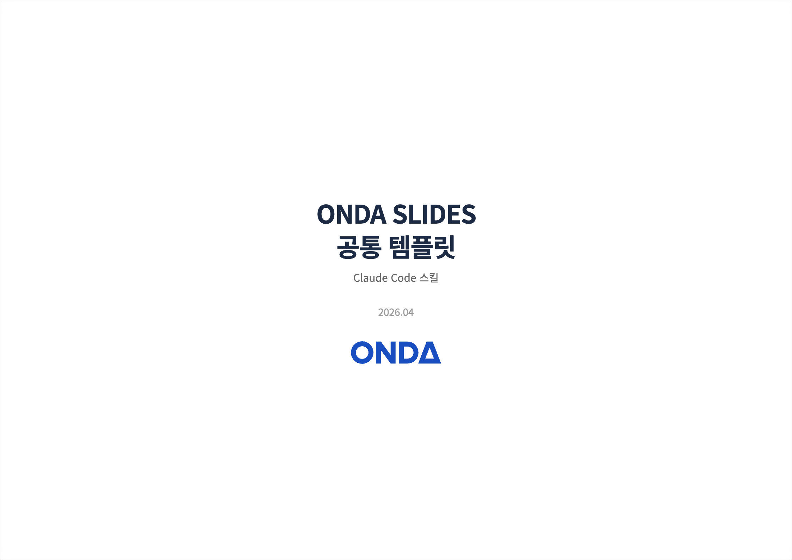

# onda-slides

ONDA 공통 템플릿을 적용한 슬라이드 프레젠테이션을 자동으로 생성하는 Claude Code 스킬입니다.
자연어로 내용을 설명하면 팀 누구나 동일한 디자인의 HTML 프레젠테이션과 PDF를 만들 수 있습니다.



## 설치

```
/plugin marketplace add git@github.com:tportio/skills.git   # 최초 1회
/plugin install onda-slides@tport-skills
```

> Private 레포라 SSH URL 로 추가합니다. tportio org 접근 권한과 GitHub 에 등록된 SSH 키가 필요합니다. 전체 플러그인 목록은 [루트 README](../../README.md) 참고.

## 왜 만들었나

팀마다 슬라이드 디자인이 제각각이면 브랜드 일관성이 깨지고, 매번 템플릿을 찾아 적용하는 데 시간이 낭비됩니다.
이 스킬은 ONDA 공통 템플릿(색상, 헤더, 폰트, 로고 배치)을 내장하고 있어서, 내용만 전달하면 통일된 디자인의 슬라이드가 바로 나옵니다.

## 사용법

```
/onda-slides [modifier...] <슬라이드 데이터>
```

modifier(맨 앞, 공백 구분, 여러 개 조합 가능)에 따라 디자인이 바뀐다.

### Modifier

| modifier | 축 | 효과 |
| --- | --- | --- |
| (없음)       | 기본       | 정보 밀도 높음. A4 landscape, 라이트 테마, 한글 |
| `simple`     | 오디언스   | 비전문가 대상. 큰 폰트, 한 슬라이드 한 메시지, 그리드 2열만, 불렛 3개 |
| `wide`      | 화면 비율 | 16:9 (PowerPoint/Google Slides 표준). 기본은 A4 landscape |
| `dark`      | 테마       | 다크 모드. 야간 행사/어두운 발표장 |
| `en`        | 언어       | 영문 폰트(Inter). 기본은 Pretendard. 영문 IR/외부 영업 |

### 호출 예시

```
/onda-slides 2026년 1분기 매출 보고서, 슬라이드 5장
   → 기본 (전문가, A4, 라이트, 한글)

/onda-slides simple 숙박업주 대상 서비스 소개 덱
   → 비전문가 큰 폰트

/onda-slides wide 팀 소개 덱
   → 16:9, 그 외 기본

/onda-slides simple wide 고객 행사 발표
   → 비전문가 + 16:9 (요즘 발표장 표준)

/onda-slides wide dark en Q1 IR deck for investors
   → 16:9 + 다크 + 영문 (외부 야간 IR)

/onda-slides 매출 simple
   → modifier 아님. content = "매출 simple" (modifier는 맨 앞에서만 인식)
```

### simple vs 기본 비교

| 항목            | 기본      | simple    |
| --------------- | --------- | --------- |
| 불렛 텍스트     | 14px      | 32px      |
| 헤더 제목       | 22px      | 44px      |
| 표              | 13px      | 24px      |
| 카드 value      | 26px      | 56px      |
| Stat 숫자       | 30px      | 72px      |
| 슬라이드당 불렛 | 제한 없음 | 최대 3개  |
| 그리드          | 2~4열     | 2열만     |
| 본문 정렬       | 위→아래   | 정중앙    |

## 기능

- ONDA 브랜드 컬러/헤더/폰트가 적용된 A4 가로 슬라이드
- Chart.js 차트 (바, 라인, 파이, 도넛 등)
- 표, 2/3/4열 그리드 레이아웃 (`simple` 모드는 2열만)
- 로고 삽입 (SVG/PNG, base64 인라인)
- Pretendard / Noto Sans KR 한글 지원
- 생성된 HTML은 브라우저에서 방향키/스페이스/클릭으로 프레젠테이션 가능 (`F` 키로 전체화면 토글)

## 출력

- `{제목}.html` — 브라우저에서 열어 프레젠테이션 가능
- `{제목}.pdf` — 공유/인쇄용 PDF

기본 출력 경로는 현재 작업 디렉토리이며, 별도 지정도 가능합니다.

## 동작 방식

1. 자연어 입력으로부터 슬라이드 구성 파악
2. ONDA 공통 템플릿이 적용된 단일 HTML 파일 생성 (CSS/JS 인라인)
3. Puppeteer로 각 슬라이드 스크린샷 캡처
4. pdf-lib로 스크린샷을 A4 landscape PDF로 조합

> `page.pdf()` 대신 스크린샷 방식을 사용하여 flex/grid 레이아웃이 깨지지 않습니다.

## 런타임 의존성

`puppeteer`와 `pdf-lib`가 필요하며, 없으면 스킬이 **스킬 자체 디렉토리**에 설치합니다(현재 작업 디렉토리가 아님 —
PDF 생성 스크립트가 ESM이라 모듈을 스크립트 위치 기준으로 찾기 때문).
